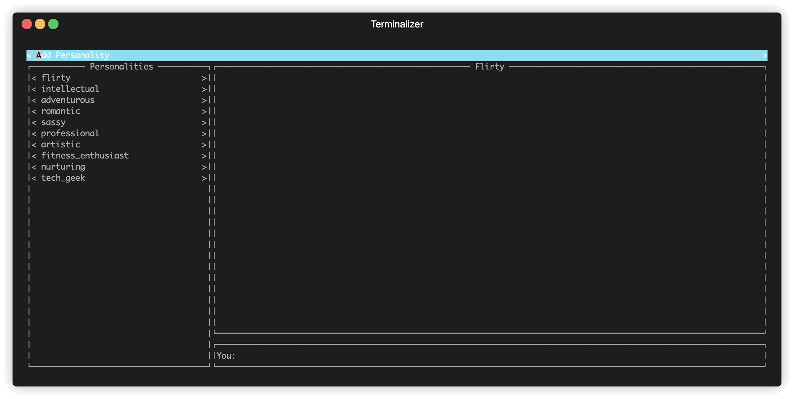

# AI Local Terminal Chat App
Just a little proof of concept of a AI chat app with different personality types based off of the Mistral model.  I wrote this in a couple of hours with Cursor.  It runs a flask server in the background which the UI can interact with.

## Running

```
pip install -r requirements.txt
python client.py
```

## Demo

